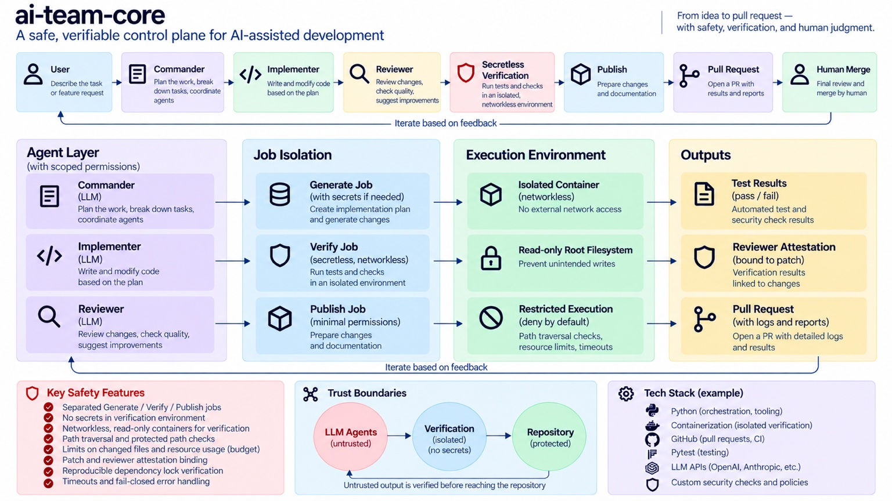
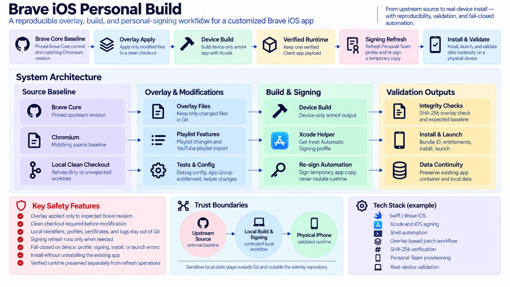
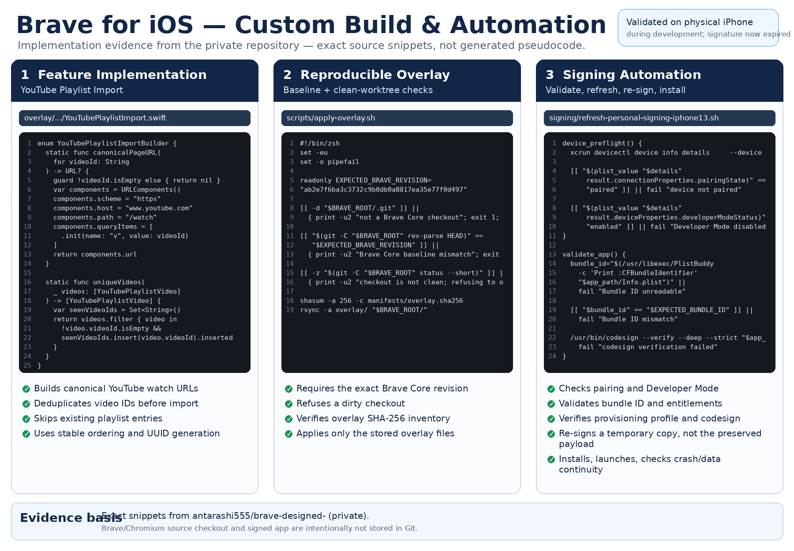
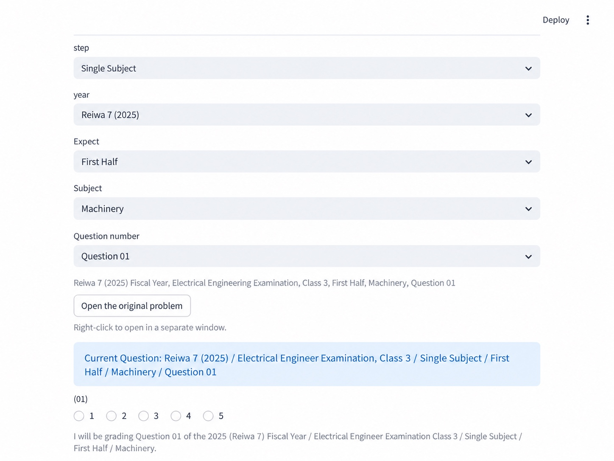
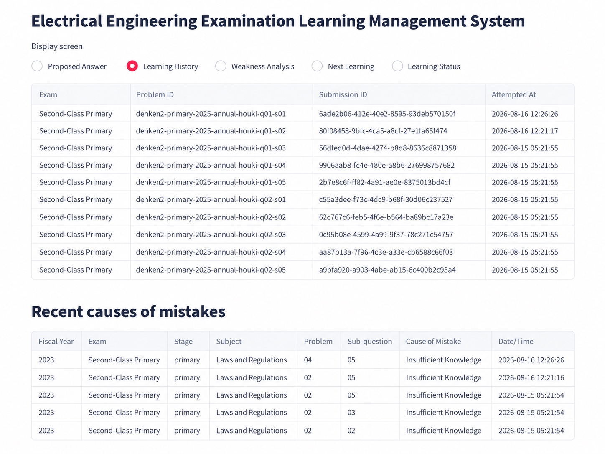
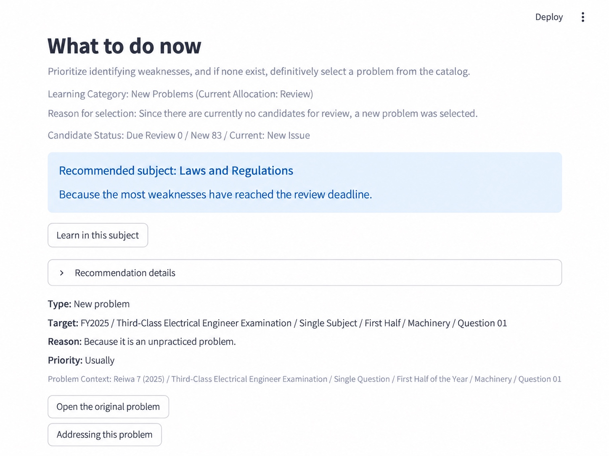

# Hiroki Chikano (近野寛貴)

**Heavy ChatGPT user for project design, implementation, debugging, verification, learning, and practical automation**

I use ChatGPT as a daily thinking and implementation partner across long, context-rich workflows. I rely on it for clarifying ideas, comparing approaches, breaking down large tasks, generating implementation candidates, reviewing output, debugging failures, and improving documentation.

My goal is not to ask ChatGPT for a final answer and accept it. I use it as an iterative partner: **ask, challenge, inspect, test, reject, refine, and repeat**. I focus on requirements, architecture, task decomposition, verification, failure handling, and human control rather than presenting myself as a conventional hand-written software developer.

---

## How I Use ChatGPT

I use ChatGPT extensively across the full lifecycle of personal projects:

- Clarifying vague ideas and converting them into concrete requirements
- Comparing architecture and implementation options
- Breaking large tasks into bounded, reviewable steps
- Generating implementation candidates
- Reviewing code, configuration, and system behavior
- Designing tests, edge cases, and failure scenarios
- Investigating logs and debugging failures
- Improving documentation and reproducibility
- Challenging my own assumptions and revising plans
- Working through long, context-rich conversations over multiple iterations
- Deciding when AI output should not be trusted without independent verification

I do not treat generated output as authoritative. I repeatedly test, review, reject, revise, and re-run suggestions until the result is supported by evidence.

---

## Selected Projects

### 1. ai-team-core

A reusable control plane for **AI-assisted software development with explicit safety and verification boundaries**.

The project separates planning, implementation, review, verification, publishing, and final human approval. The goal is to make AI-assisted development more reproducible and reduce the risk of unverified changes reaching a repository.

<p align="center">
  
</p>

**Key design points**

- Separate Generate / Verify / Publish stages
- Secretless verification
- Networkless, read-only verification environment
- Protected-path and path-traversal checks
- Patch-bound reviewer attestation
- Resource limits and timeouts
- Fail-closed handling
- Final merge remains a human decision

**How ChatGPT was used**

ChatGPT was used throughout the project to explore workflow architectures, refine safety boundaries, generate implementation candidates, review edge cases, interpret test failures and logs, propose additional verification cases, and improve documentation. Suggestions were not accepted automatically; they were tested, challenged, and revised through repeated iterations.

**My role**

I defined the workflow, safety boundaries, expected behavior, and verification strategy, then used AI agents for implementation and iterative refinement. I focused on what each component was allowed to do, how results would be verified, and how failures should be handled.

**Technical environment:** Python-based tooling, GitHub Actions, GitHub App authentication, Docker-based verification, pytest, OpenAI API

**Source:** Private repository.

---

### 2. Brave iOS Personal Build

A customized Brave iOS build with a **reproducible overlay workflow, Personal Team signing maintenance, and real-device validation**.

Rather than keeping a full Brave/Chromium checkout in Git, the project preserves only the modified overlay, reconstruction instructions, manifests, and signing automation. The build was validated on a physical iPhone during development; the current signed build has expired.

<p align="center">
  
</p>

#### Implementation evidence

The following image uses source snippets taken from the private repository rather than generated pseudocode.

<p align="center">
  
</p>

**What the project demonstrates**

- Modified selected Brave iOS playlist functionality
- Added YouTube playlist import support
- Pinned the expected Brave Core / Chromium baseline
- Refused unexpected or dirty worktrees before overlay application
- Verified the overlay inventory with SHA-256
- Automated Personal Team signing refresh
- Validated bundle identity, entitlements, installation, launch, and data continuity
- Kept device identifiers, profiles, certificates, logs, and credentials outside Git

**How ChatGPT was used**

ChatGPT was used to navigate the large upstream codebase, identify modification points, reason about build and signing constraints, generate and revise implementation candidates, investigate failures, and refine the reproducible overlay and signing workflow.

**My role**

I defined the modification goals and workflow, used AI-assisted implementation and debugging, and repeatedly validated the build and signing process on a physical device.

**Technical environment:** Swift, Brave iOS, Xcode, shell automation, iOS code signing

**Source:** Private repository.

---

### 3. Denken Study Manager

A personal learning-management application for the Japanese **Electrical Engineering Examination (Denken)**.

The application is designed around a simple loop:

**Practice → Record → Analyze → Recommend**

It reduces manual study management by recording answers, preserving learning history, tracking mistake causes, and selecting the next study task.

#### Practice

<p align="center">
  
</p>

#### Learning history and mistake tracking

<p align="center">
  
</p>

#### Next-learning recommendation

<p align="center">
  
</p>

**Key design points**

- Stores learning history and evaluation results
- Tracks structured causes of mistakes
- Suggests review priorities and next tasks
- Uses deterministic grading for multiple-choice answers
- Uses AI-assisted evaluation for descriptive answers
- Keeps the user in the loop before AI-generated evaluation becomes authoritative
- Separates UI, application services, persistence, and AI-provider boundaries

**How ChatGPT was used**

ChatGPT was used to turn study-management ideas into requirements, compare data-flow and UI approaches, generate implementation candidates, review grading and recommendation logic, investigate bugs, and refine the application through repeated testing.

**My role**

I defined the product requirements, learning workflow, data model, and expected behavior, then used AI-assisted implementation and repeated testing to refine the application.

**Technical environment:** Python, Streamlit, SQLite, OpenAI API

**Source:** Private repository.

---

## My Working Method

```text
Define the outcome
        ↓
Clarify requirements with ChatGPT
        ↓
Break the task into bounded work
        ↓
Generate implementation candidates
        ↓
Inspect behavior and evidence
        ↓
Test edge cases and failure modes
        ↓
Challenge and revise the output
        ↓
Repeat
```

I am especially interested in AI evaluation, agent orchestration, human-in-the-loop systems, deterministic verification, failure-resistant automation, long-context workflows, and practical use of AI in unfamiliar technical domains.


---

## Technical Familiarity

I have **AI-assisted working familiarity** with Python-based projects, Swift / iOS project structure, Streamlit, SQLite, Git / GitHub, GitHub Actions, OpenAI API, Docker-based verification, shell automation, and local LLM experimentation.

I can follow basic code structure, data flow, configuration, logs, tests, and database concepts. I do **not** present myself as a conventional software engineer who manually writes these systems from scratch.

---

## Background

**Nihon University, College of Law**  
Bachelor's degree, 2023

**Reload Edge Inc.**  
Restaurant Staff, 2023 – March 2025

---

## Contact

GitHub: [antarashi555](https://github.com/antarashi555)
